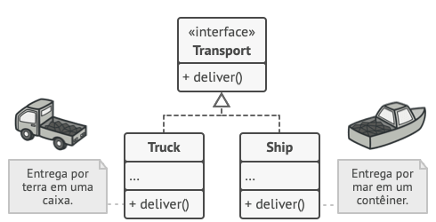
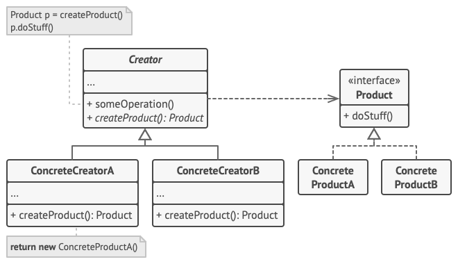
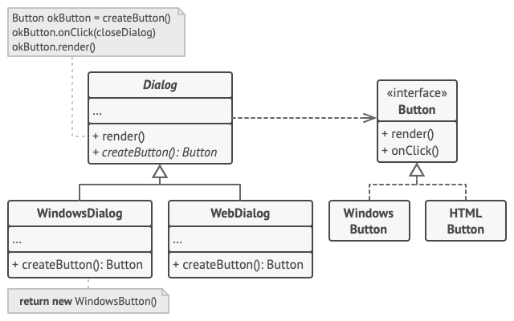

# Factory Method

## Contexto
É um padrão que criacional que fornece uma interface de criação em uma superclasse, porém que permite 
que as subclasses alterem o tipo de objetos que serão criados.

## Problema

Imagine que você está tentando criar uma aplicação de gerenciamento de logística. A primeira versão da sua aplicação pode lidar com apenas o transporte para caminhões, portanto a maior parte do código ficará dentro de **Caminhão**.

Depois de um tempo sua aplicação precisa de expansão, porém como a maior parte do código implementado está acoplado a **Caminhão** isso pode ser um problema. Tentar adicionar uma classe como **Avião** a sua aplicação exigiria alterações em toda sua base de código. Como resultado disso você terá um código bastante sujo e repleto de condicionais que alteram o comportamento da aplicação.

## Solução

O padrão **Factory Method** Surge como uma alternativa a isso, com ele é sugerido que o desenvolvedor substitua instânciações diretas de objetos por chamadas de um método de fábrica especial. 

Para implementar essa solução é necessário criar uma interface que será implementada pelas classes existentes, cada classe implementa os métodos da interface de forma única

O código que usa o método fábrica (geralmente chamado de código cliente) não vê diferença entre os produtos reais retornados por várias subclasses. O cliente trata todos os produtos como um Transporte abstrato. O cliente sabe que todos os objetos de transporte devem ter o método entregar, mas como exatamente ele funciona não é importante para o cliente.

### Estrutura

1. O Produto declara a interface, que é comum a todos os objetos que podem ser produzidos pelo criador e suas subclasses.

2. Produtos Concretos são implementações diferentes da interface do produto.

3. A classe Criador declara o método fábrica que retorna novos objetos produto. É importante que o tipo de retorno desse método corresponda à interface do produto.

Você pode declarar o método fábrica como abstrato para forçar todas as subclasses a implementar suas próprias versões do método. Como alternativa, o método fábrica base pode retornar algum tipo de produto padrão.

Observe que, apesar do nome, a criação de produtos não é a principal responsabilidade do criador. Normalmente, a classe criadora já possui alguma lógica de negócio relacionada aos produtos. O método fábrica ajuda a dissociar essa lógica das classes concretas de produtos. Aqui está uma analogia: uma grande empresa de desenvolvimento de software pode ter um departamento de treinamento para programadores. No entanto, a principal função da empresa como um todo ainda é escrever código, não produzir programadores.

4. Criadores Concretos sobrescrevem o método fábrica base para retornar um tipo diferente de produto.

Observe que o método fábrica não precisa criar novas instâncias o tempo todo. Ele também pode retornar objetos existentes de um cache, um conjunto de objetos, ou outra fonte.

## Créditos 

https://refactoring.guru